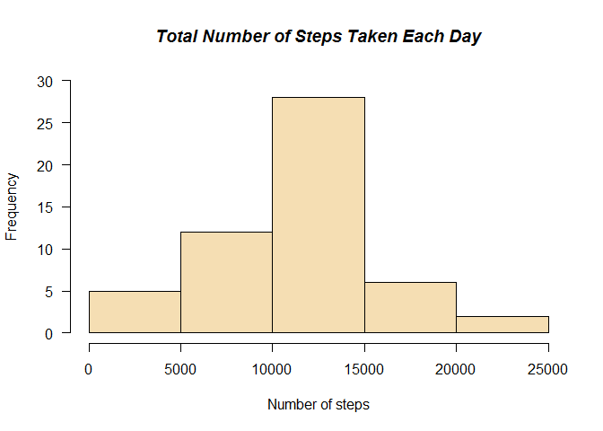
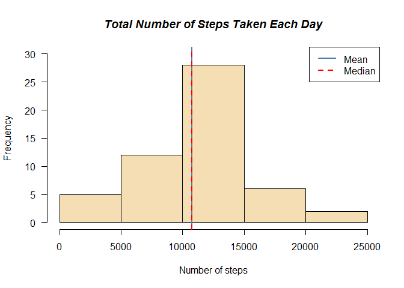
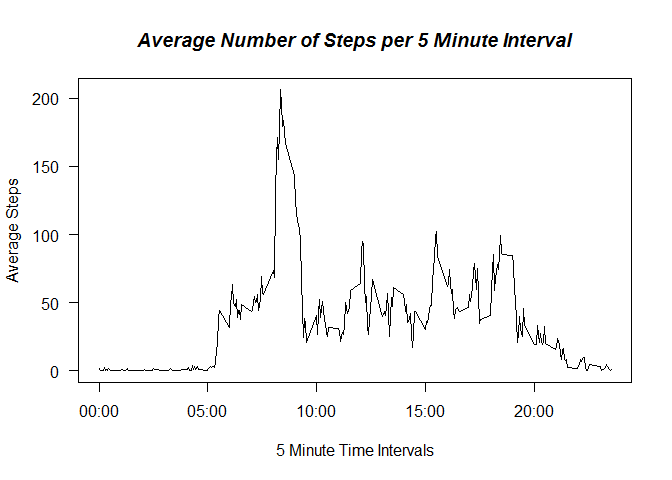
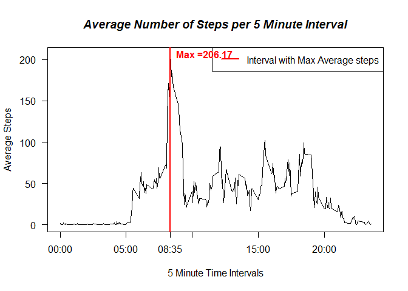
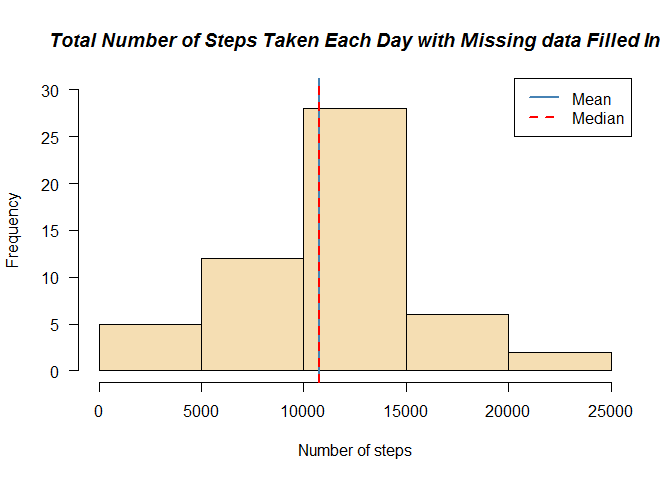
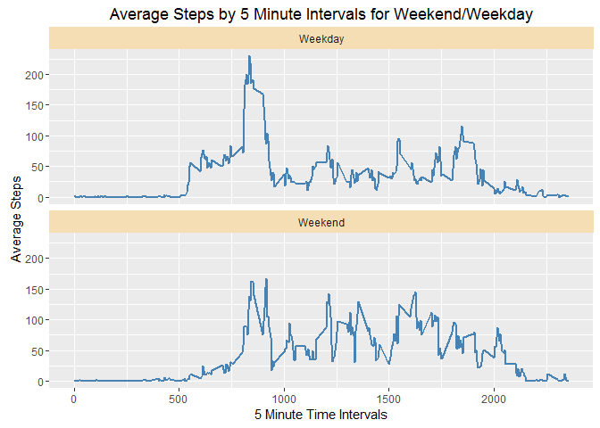

# Reproducible Research: Peer Assessment 1
## Loading and preprocessing the data
### 1.Load the data

```r
data<-read.csv("activity.csv")
```

### 2. Tansform the data - get a complete set with no missing values

```r
completeData<-subset(data,complete.cases(data))
```

## What is mean total number of steps taken per day?
### 1. Calculate the total number of steps taken per day

```r
dailytotals<-aggregate(completeData$steps,
                       list(date =completeData$date),
                       sum)
```

### 2. Make a histogram of the total number of steps taken each day

```r
hist(dailytotals$x,
     main=NULL,
     xlab="Number of steps",
     col="wheat",
     ylim = c(0,30),
     las=1)
title(main = "Total Number of Steps Taken Each Day",
      font.main=4)
```

<!-- -->

### 3.Report the mean and median of the total number of steps taken per day

* Calculate mean and median
* Plot 
* Add lines for mean and median 
* Add legend  (note that the line are on top of each other)
  

```r
dailytotals_mean <-mean(dailytotals$x)
dailytotals_median <-median(dailytotals$x)
hist(dailytotals$x,
     main=NULL,
     xlab="Number of steps",
     col="wheat",
     ylim = c(0,30),
     las=1)
abline(v=dailytotals_mean,
       col="steelblue",
       lwd=2,
       lty = 1)
abline(v=dailytotals_median,
       col="red",
       lwd=2,
       lty=2)
legend("topright",
       c("Mean", "Median"), 
       lty=c(1,2), 
       col=c("steelblue", "red"), 
       lwd=2)
title(main = "Total Number of Steps Taken Each Day",
      font.main=4)
```

<!-- -->

## What is the average daily activity pattern?
### 1. Make a time series plot of the 5-minute interval and the average number of steps taken, averaged across all days

* Get Mean data by Interval  
* Create HH:MM format for plot
* Plot graph


```r
dailymean<-aggregate(completeData$steps,
                    list(interval =completeData$interval) ,
                     mean)
# use some dummy date, the first one inte file
dailymean$HHMM<-format(as.POSIXct("2012-10-01", format= "%Y-%m-%d") +
                       (floor(dailymean$interval / 100)*60*60)+
                       ((dailymean$interval %% 100)*60), "%H:%M")
plot(x =dailymean$interval ,
     y=dailymean$x, 
     main=NULL,
     type = "l",
     xlab = "5 Minute Time Intervals",
     xaxt= "n",
     ylab = "Average Steps",
     las=1)
xLabels<-seq(0,2000,500)
axis(1,at=xLabels,labels = dailymean[dailymean$interval %in% xLabels,]$HHMM)
title(main = "Average Number of Steps per 5 Minute Interval",
      font.main=4)
```

<!-- -->

```r
#
```

### 2. Which 5-minute interval contains the maximum number of steps?
* Get the Max Average (y)
* Get the time interval for the max (x)
* Plot graph
* Add line, Add point and label, Add Legend


```r
maxAverage<-max(dailymean$x)
intervalWithMax<-dailymean[maxAverage==dailymean$x,]$interval

plot(x =dailymean$interval ,
     y=dailymean$x, 
     main=NULL,
     type = "l",
     xlab = "5 Minute Time Intervals",
     xaxt= "n",
     ylab = "Average Steps",
     #xlim = c(0000,2355),
     las=1)
xlabels<-c(seq(0,2000,500),intervalWithMax)
xlabels<-xlabels[order(xlabels)]
axis(1,at=xlabels,labels = dailymean[dailymean$interval %in% xlabels,]$HHMM)
abline(v=dailymean[max(dailymean$x)==dailymean$x,]$interval,
       col="red",
       lwd=2)
legend("topright",
       "Interval with Max Average steps", 
       lty=1, 
       col= "red",
       lwd=2)
title(main = "Average Number of Steps per 5 Minute Interval",
      font.main=4)
text(intervalWithMax,
     maxAverage,
     labels=paste0("Max =",toString(round(maxAverage,2))),
     col = "red",
     font = 2,
     pos = 4)
```

<!-- -->

## Imputing missing values
### 1. Calculate and report the total number of missing values in the dataset


```r
 narowcount<-length(data$steps[is.na(data$steps)])
```

 There are 2304 rows in the source data the have na.

## 2. Devise a strategy for filling in all of the missing values in the dataset.
  Since we already have the mean per 5 minute interval let's use that to fill 
  in the missing data
  
  * Get subset with missing data
  * Merge with dailymean data to create a data frame 
    that has all the missing data
    
    

```r
MissingData<-data[is.na(data$steps),]
naMapfill<-merge(MissingData,dailymean,by.x="interval",by.y ="interval")
```
  
## 3. Create a new dataset that is equal to the original dataset but with the missing data filled in.

 * Update the nas in naMapfill with mean for that interval
 * Create NewData by rbinding completedata and naMapfill
    
 

```r
 naMapfill$steps<-naMapfill$x
 
 NewData<-rbind(completeData[c("steps","date","interval")],
                     naMapfill[c("steps","date","interval")])
```

## 4. Make a histogram of the total number of steps taken each day  and Calculate and report the mean and median total number of   steps taken per day.

 as done above

* caluculate daily totals
* Calculate mean and median
* Plot 
* Add lines for mean and median 
* Add legend  

```r
newdailytotals<-aggregate(NewData$steps,
                       list(date =NewData$date),
                       sum)

newdailytotals_mean <-mean(newdailytotals$x)
newdailytotals_median <-median(newdailytotals$x)
hist(dailytotals$x,
     main= NULL,
     xlab="Number of steps",
     col="wheat",
     ylim = c(0,30),
     las=1)
abline(v=newdailytotals_mean,
       col="steelblue",
       lwd=2,
       lty = 1)
abline(v=newdailytotals_median,
       col="red",
       lwd=2,
       lty=2)
legend("topright",
       c("Mean", "Median"), 
       lty=c(1,2), 
       col=c("steelblue", "red"), 
       lwd=2)
title(main ="Total Number of Steps Taken Each Day with Missing data Filled In",
      font.main=4)
```

<!-- -->

## Do these values differ from the estimates from the first part of the assignment? 

**No they do not differ from the first part of the assignment.

## What is the impact of imputing missing data on the estimates of the total daily number of steps?

**I see no impact 

## Are there differences in activity patterns between weekdays and weekends?

#1. Create a new factor variable in the dataset with two levels – “weekday” and “weekend” 


```r
#set days of week
NewData$week<-weekdays(as.POSIXct(NewData$date, format ="%Y-%m-%d"))
#set Weekend
NewData$week[NewData$week %in% c("Saturday","Sunday")]<-"Weekend"
#if it's not a weekend udt be weekday
NewData$week[NewData$week != "Weekend"]<-"Weekday"
```
#2.Make a panel plot containing a time series plot,5-minute interval by average number of steps taken

* First get average steps for Interval and weekday/weekend

```r
weekdata<-aggregate(NewData$steps,
          list(interval=NewData$interval,
               week = NewData$week),
        mean)
```
* plot the data

```r
# load ggplot2
library(ggplot2)
```

```
## Warning: package 'ggplot2' was built under R version 3.2.5
```

```r
# build plot - base info
g<-ggplot(weekdata,aes(interval,x))
g<-g+geom_line(col = "steelblue",lwd=1) 
g<-g+facet_wrap(~week,ncol=1)
# set labels
g<-g+labs(x ="5 Minute Time Intervals")
g<-g+labs(y="Average Steps")
g<-g+labs(title="Average Steps by 5 Minute Intervals for Weekend/Weekday", font=4)
# set strip label
g<-g+theme(strip.background = element_rect(colour = "wheat",
                                           fill = "wheat",size = 3))
print(g)
```

<!-- -->
